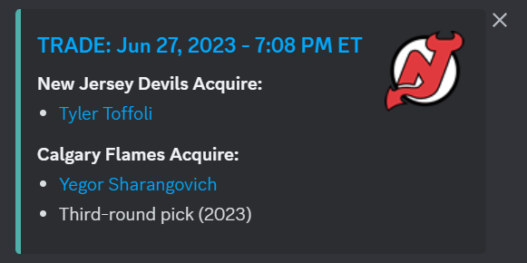
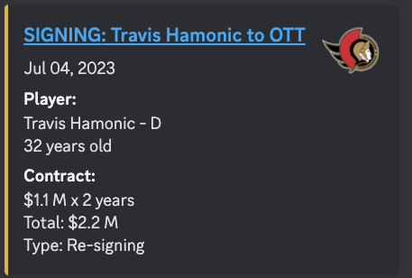

# TradeTracker
TradeTracker is a Discord bot that scrapes Sportsnet to find the most recent NHL trades and signings. It allows you to receive hockey news through Discord! It was originally created to reduce the amount of hockey posts in my Instagram feed. 

Add the bot to your own server using [this link](https://discord.com/api/oauth2/authorize?client_id=1125076817162801162&permissions=534723950656&scope=bot)!

Created with discord.py and Selenium. 

## Commands
`!subscribechannel` - bot will send any new scraped updates to that channel [Admin only].

`!unsubscribechannel` - bot will remove that channel from subscribed updates [Admin only]. 

`!ping` - bot will return `pong`. Used to see if bot is working. 

## Installation
Clone the repo and create a virtual environment.

Add a `.env` with the bot's token and other secret information.

Run `pip install -r requirements.txt` to install dependencies. 

Run `python main.py` to start up the bot!
